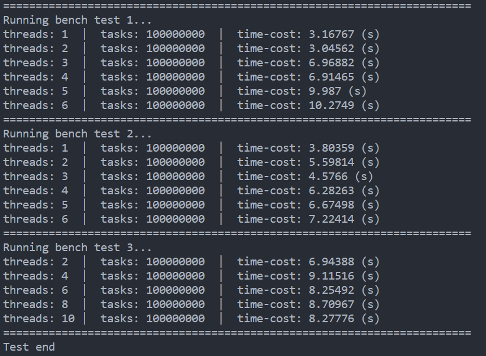
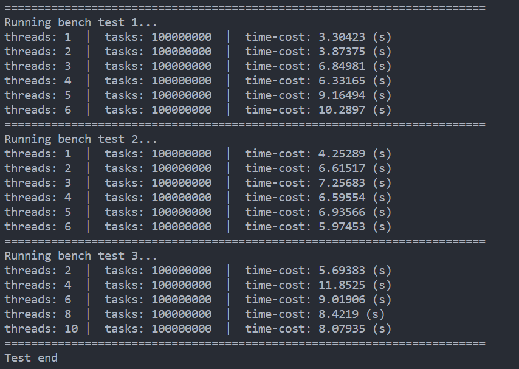

## Info

```sh
./test.sh
```



test 1: 在 threadbatch 中开多个线程跑10一组的序列空任务，相当于最普通常见的线程池。

test 2: 由 threadpool 进行任务分发给只拥有一个线程的 threadbatch，threadpool 通过寻找当前任务数较少的 threadbatch ，进行任务的负载均衡。但是它的优势不止如此，它还保证了线程池的安全退出、更简单的使用接口、增加对线程池执行的监控模块。它还优化了传统线程池实现中可能出现的资源未及时分配或者未及时回收，而不得不使用 sleep 之类的等待策略的问题。

test 3: 相比于 test 2 ，每个 threadbatch 中开了 2 个线程。

> 使用 Arch WSL 系统，双核 4G 配置。 CPU AMD Ryzen 9 4900HS。


整体框架：threadpool 向 threadbatch 分发任务，并控制资源分配。由 supervisor 监控 threadbatch 执行，可以注册定时任务以打印日志。threadbatch 就相当于传统的线程池。


**原作者框架：[CodingHanYa/workspace](https://github.com/CodingHanYa/workspace)**

和大佬不同的地方在于：

- 使用了不同的任务分发策略，会遍历每个 threadbatch ，只要找到比第一个 threadbatch 任务少的 threadbatch ，就将任务分发给它，否则分发给第一个 threadbatch。
- 优化一点C++语言上的实现细节，但是几乎对性能没有影响。不过对 explicit 相关的构造函数进行了改进。
- 简化一些设计，比如增加了 noncopyable 基类。

原框架在同配置下的运行结果（运行前都进行了预热）：



